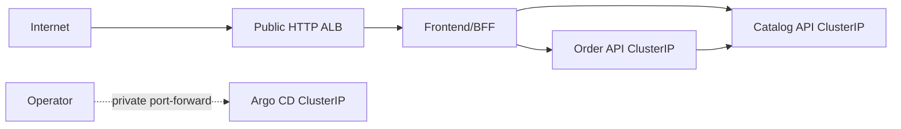

# TechX Chart

Helm and Argo CD configuration for the TechX internship thin slice. The chart
owns exactly three restricted workloads and exposes only the frontend through
one temporary AWS ALB Ingress.

## Validate and test

Static checks render the AWS desired state, exercise schema-negative cases,
and assert resource count, exposure, rollout, probe, secret, and security
contracts:

```powershell
./scripts/verify.ps1
```

The local overlay keeps production-like Deployments, Services, probes,
resources, security contexts, Secret references, and NetworkPolicies while
disabling the AWS-specific Ingress. It uses the Phase 4 images already built
as `techx/frontend:local`, `techx/catalog:local`, and `techx/order:local`:

```powershell
./scripts/local-k8s.ps1 -Action Test
./scripts/local-k8s.ps1 -Action Cleanup
```

The test profile uses Minikube with Calico, executes the real business flow,
restarts Catalog, performs Helm upgrade/rollback, verifies an untrusted pod is
denied, and uninstalls the release and workload namespace. No ALB is mocked or
claimed as locally tested.

## Phase 9 AWS acceptance and GitOps rollback

After a newly reviewed AWS apply and immutable image publish, run the cloud-only
checks in this order. The script never changes Git or pushes an image; those
auditable changes remain explicit operator steps:

```powershell
./scripts/phase9-aws-acceptance.ps1 -Action Baseline -PublicUrl 'http://<alb-dns-name>/'
./scripts/phase9-aws-acceptance.ps1 -Action SelfHeal

# Push the reviewed values-demo.yaml commit that selects the candidate immutable tag.
./scripts/phase9-aws-acceptance.ps1 -Action WaitRevision -ExpectedRevision '<candidate-chart-sha>' -ExpectedImageTag 'demo-<candidate-sha>'

# git revert <candidate-chart-sha>, review the diff, and push the revert.
./scripts/phase9-aws-acceptance.ps1 -Action WaitRevision -ExpectedRevision '<revert-chart-sha>' -ExpectedImageTag 'demo-<baseline-sha>'
```

`Baseline` proves Argo health, restricted Pod Security labels, the exact three
Deployments, private backend Services, the single frontend-only Ingress, public
security headers, request-ID correlation, and the frontend ServiceAccount's lack
of Kubernetes API permissions. `SelfHeal` creates controlled replica drift and
waits for convergence. `WaitRevision` ties candidate and revert evidence to an
exact Git revision and immutable image tag. Run this only while the approved demo
environment exists; every new apply still requires fresh owner confirmation.

## GitOps ownership

`gitops/clusters/demo/application.yaml` is the only workload bootstrap object
applied manually on AWS. Argo CD reads `values-demo.yaml`, creates the
restricted namespace, then owns sync, prune, self-heal, and rollback-by-revert.
The Secret is always bootstrapped outside Git. Catalog, Order, and Argo CD stay
private; no observability stack or public administrative UI is included.

## Shared deployment contract

This table is the handoff contract copied verbatim across `techx-platform`,
`techx-chart`, and `techx-infra`. Contract changes must update all three
copies, every affected consumer, and the corresponding tests in one coordinated
change.

| Contract item | Locked value |
| --- | --- |
| AWS region | `us-east-1` |
| Kubernetes namespace | `techx-demo` |
| Services / ports | `frontend:3000`, `catalog-api:3001`, `order-api:3002` |
| Cluster DNS | `frontend.techx-demo.svc.cluster.local:3000`, `catalog-api.techx-demo.svc.cluster.local:3001`, `order-api.techx-demo.svc.cluster.local:3002` |
| Secret / key | Secret `techx-demo-secrets`, data key `order-api-key`; injected as `ORDER_API_KEY` only into frontend and Order |
| Runtime environment | Frontend: `CATALOG_API_URL`, `ORDER_API_URL`, `ORDER_API_KEY`; Catalog: `CATALOG_PORT`; Order: `ORDER_PORT`, `CATALOG_API_URL`, `ORDER_API_KEY`, `ORDER_STORE_TTL_MS`, `ORDER_STORE_MAX_RECORDS` |
| Health / readiness | Every service exposes unauthenticated `GET /healthz` and `GET /readyz` |
| Order store | In-memory, TTL `3600000` ms, maximum `1000` records; restart intentionally loses orders and idempotency records |
| Pricing | Catalog price snapshot; shipping `999` cents below subtotal `5000`, otherwise free; `totalCents = subtotalCents + shippingCents` |
| Images | `058114477594.dkr.ecr.us-east-1.amazonaws.com/techx/frontend:demo-{short-sha}`, `.../techx/catalog:demo-{short-sha}`, `.../techx/order:demo-{short-sha}` |
| Exposure | Exactly one temporary public HTTP ALB routes to frontend/BFF; Catalog, Order, Argo CD, and any administrative UI remain private `ClusterIP` services |
| Public URL | `http://{alb-dns-name}/`; no custom domain and no public observability URL |



Licensed under Apache-2.0. See [LICENSE](LICENSE).

Bootstrap verification:

```powershell
./scripts/verify.ps1
```
