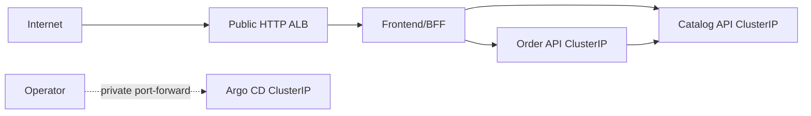

# TechX Chart

Helm and Argo CD configuration for the TechX internship thin slice. Workload
manifests are implemented in Phase 5 after the platform contract is verified
locally.

## Shared deployment contract

This table is the handoff contract copied verbatim across `techx-platform`,
`techx-chart`, and `techx-infra`. Contract changes must update all three
copies, every affected consumer, and the corresponding tests in one coordinated
change.

| Contract item | Locked value |
| --- | --- |
| AWS region | `us-east-1` |
| Kubernetes namespace | `techx-demo` |
| Services / ports | `frontend:3000`, `catalog-api:3001`, `order-api:3002` |
| Cluster DNS | `frontend.techx-demo.svc.cluster.local:3000`, `catalog-api.techx-demo.svc.cluster.local:3001`, `order-api.techx-demo.svc.cluster.local:3002` |
| Secret / key | Secret `techx-demo-secrets`, data key `order-api-key`; injected as `ORDER_API_KEY` only into frontend and Order |
| Runtime environment | Frontend: `CATALOG_API_URL`, `ORDER_API_URL`, `ORDER_API_KEY`; Catalog: `CATALOG_PORT`; Order: `ORDER_PORT`, `CATALOG_API_URL`, `ORDER_API_KEY`, `ORDER_STORE_TTL_MS`, `ORDER_STORE_MAX_RECORDS` |
| Health / readiness | Every service exposes unauthenticated `GET /healthz` and `GET /readyz` |
| Order store | In-memory, TTL `3600000` ms, maximum `1000` records; restart intentionally loses orders and idempotency records |
| Pricing | Catalog price snapshot; shipping `999` cents below subtotal `5000`, otherwise free; `totalCents = subtotalCents + shippingCents` |
| Images | `058114477594.dkr.ecr.us-east-1.amazonaws.com/techx/frontend:demo-{short-sha}`, `.../techx/catalog:demo-{short-sha}`, `.../techx/order:demo-{short-sha}` |
| Exposure | Exactly one temporary public HTTP ALB routes to frontend/BFF; Catalog, Order, Argo CD, and any administrative UI remain private `ClusterIP` services |
| Public URL | `http://{alb-dns-name}/`; no custom domain and no public observability URL |



Licensed under Apache-2.0. See [LICENSE](LICENSE).

Bootstrap verification:

```powershell
./scripts/verify.ps1
```
