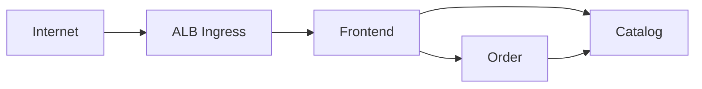

# TechX Chart

Helm and Argo CD configuration for the TechX internship thin slice. Workload manifests are implemented in Phase 5 after the platform contract is verified locally.

## Shared deployment contract

| Item | Value |
|---|---|
| Namespace | `techx-demo` |
| Secret / key | `techx-demo-secrets` / `order-api-key` |
| Services | `frontend:3000`, `catalog-api:3001`, `order-api:3002` |
| Health / readiness | `GET /healthz` / `GET /readyz` |
| Image tag | Immutable `demo-<short-sha>`; never `latest` |
| Exposure | One ALB Ingress to frontend; Catalog/Order remain `ClusterIP` |



Licensed under Apache-2.0. See [LICENSE](LICENSE).

Bootstrap verification:

```powershell
./scripts/verify.ps1
```
